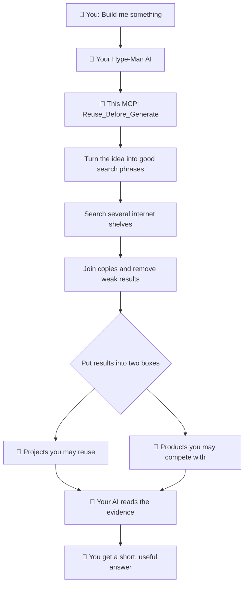

# reuse-before-generate

[](https://www.npmjs.com/package/reuse-before-generate)
[](https://github.com/aradar46/reuse-before-generate/actions/workflows/ci.yml)
[](LICENSE)
[](https://glama.ai/mcp/servers/aradar46/reuse-before-generate)

# Your idea probably already exists. Find out before you build it, not after.

You ask an AI model about an idea, it tells you the space is wide open. You tell your agent to build it, and it churns out thousands of lines for something that already exists or nobody wants.

That happened to me. I kept hitting the same failing Android CI build and wished I could pause it, open a shell inside, fix the bug, and rerun. I asked THE Fable 5, it told me it was a brilliant idea, so I built [fermata](https://github.com/aradar46/fermata). A complete waste of time, tokens, and energy. Later I found out tools like action-tmate, actl, and actdbg already existed. AI models are just overenthusiastic and blind to what is out there.

## The big picture



 Sometimes your version really is different and you should keep going. Sometimes it saves you a weekend. Either way, you find out after **ten seconds instead of 10,000 lines of code.**

## Why bother?

Fewer **wasted hours,** fewer **abandoned project**s, and less **energy** burned generating duplicate code and **hurting the environment**. Jenna Pederson nailed it in **[*You Can Build It, But Should You?*](https://dev.to/jennapederson/you-can-build-it-should-you-9e0),** AI removed the friction that used to make us ask whether something is worth building at all.

For the record, this tool did not survive its own test either. But I had to build it to find out, and hopefully it keeps me from doing it again.

---

## ⚡ Quick Start & Installation

**No API keys** required to start. But **Tavily API key is recommended,** it is free to some extent and gives better competition coverage.

### 1. Claude Code CLI

To install it for all projects, run:

```bash
claude mcp add -s user reuse-before-generate -- npx -y reuse-before-generate
# To install it for current project only:
# claude mcp add reuse-before-generate -- npx -y reuse-before-generate
```

---

### 2. Cursor, Claude Desktop, Antigravity IDE, Windsurf, or VS Code

Add this snippet to your `mcpServers` configuration (e.g., `~/.claude/mcp.json`, `~/.gemini/antigravity-ide/mcp_config.json`, or Cursor's MCP settings):

```json
{
  "mcpServers": {
    "reuse-before-generate": {
      "command": "npx",
      "args": ["-y", "reuse-before-generate@latest"]
    }
  }
}
```

---

### 3. Optional: Add Search Keys (Higher Limits & Web Search)

For higher GitHub rate limits and broader web discovery, pass optional API keys in your environment:

```json
{
  "mcpServers": {
    "reuse-before-generate": {
      "command": "npx",
      "args": ["-y", "reuse-before-generate@latest"],
      "env": {
        "GITHUB_TOKEN": "github_pat_your_token_here",
        "TAVILY_API_KEY": "tvly_your_key_here"
      }
    }
  }
}
```

- **`GITHUB_TOKEN`**: Increases GitHub API search rate limit (from 10 to 30 req/min).
- **`TAVILY_API_KEY`**: Enables web search to discover non-GitHub commercial products & SaaS tools.

---

## 🤖 Make It Automatic:

By default, your AI agent only checks when you explicitly ask. To force your agent to check **automatically** before building anything new, add this paragraph to your `CLAUDE.md`, `.cursorrules`, or `AGENTS.md`:

```markdown
Before scaffolding a new project or building a substantial new module, call
`check_before_building` (or `reuse_before_generate`) from the `reuse-before-generate` MCP server first.
If it finds maintained open-source alternatives or competing products, present them and ask whether
to reuse/extend an existing project instead of building from scratch.
```

---

## 💡 How It Works (At a Glance)

1. **Multi-Shelf Search**: Searches GitHub, GitLab, Show HN, package registries (npm, PyPI, crates.io, RubyGems, Maven), and Tavily web search.
2. **Dual-Box Evidence**: Distinguishes between:
   - 🧩 **Projects you could reuse** (maintained open-source repositories)
   - 🏪 **Products you would compete with** (SaaS tools & commercial software)
3. **Zero Extra Cost**: Doesn't make any separate LLM API calls. It returns raw, ranked evidence so your active AI session performs the semantic evaluation.

---

## Known Limitations

- **Formulation Sensitivity**: Keyword and formulation generation depends on the calling agent providing clear intent terms.
- **Small or Niche Repositories**: GitHub search occasionally buries very new or low-star repositories (under 5 stars).
- **Maintenance Heuristic**: Repositories active within the last year are considered active; deep contributor/issue health analysis is left to the calling agent.
- **Optional Web Key**: Web product discovery relies on `TAVILY_API_KEY`. Without it, web search is reported as unavailable.

---

## 📖 Deep Dives & Documentation

For technical details, pipeline architecture, and local development:

- 🏗️ **[How It Works & Pipeline](docs/how-it-works.md)** — Pipeline architecture, canonicalization, and query execution.
- 🛠️ **[Local CLI & Development](docs/how-it-works.md#development)** — Running from source, unit tests, and local evaluation suite.

---

## License

[MIT](LICENSE)
